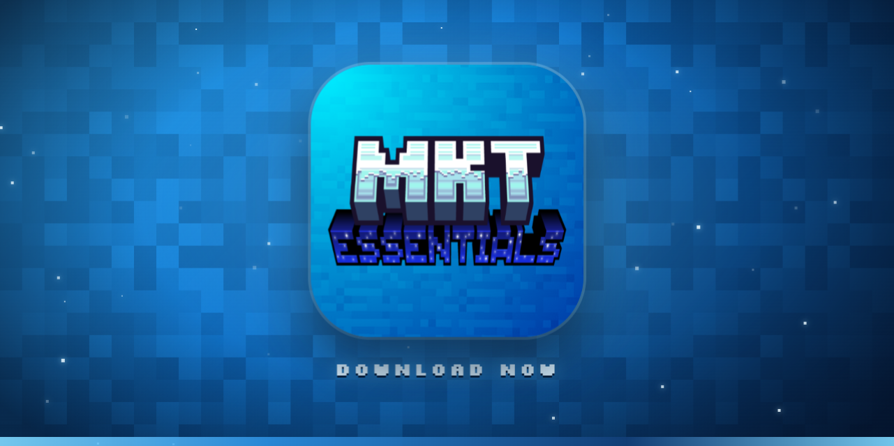
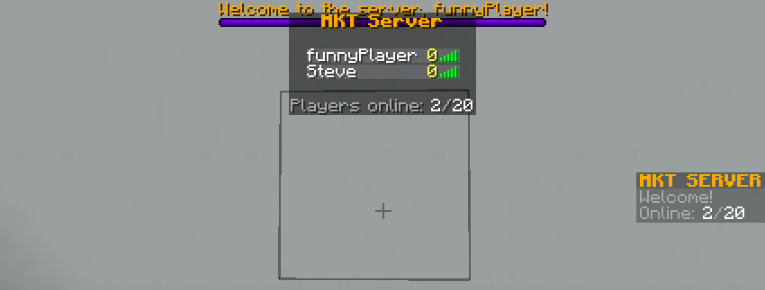

# MKT Essentials



A powerful, lightweight, **all-in-one** server utility mod for **NeoForge 1.21.1**. Teleportation,
rich chat & cosmetics, moderation, an authentication system with an embedded Discord bot and a
2-way chat relay, inventory backups, item cleanup and much more — all configurable via YAML, all
**server-side** (vanilla clients need nothing).

- **Minecraft:** 1.21.1 · **Loader:** NeoForge 21.1.228+ · **Java:** 21
- **Mod ID:** `mktessentials` · **Version:** 1.0.0

---

## 📚 Documentation

| Guide | What's inside |
|-------|---------------|
| [Chat & Cosmetics](docs/chat-and-cosmetics.md) | Nicknames, markdown, objects, mentions, tab list, nametags, sidebar, boss bar, brand, greeting, MOTD |
| [Commands](docs/commands.md) | Full command reference with permission nodes |
| [Configuration & Setup](docs/configuration.md) | Install, config layout, snippets, building, troubleshooting |
| [Authentication & Discord](docs/auth-and-discord.md) | Auth modes, Discord linking bot, **2-way chat relay** |
| [Integrations & Permissions](docs/integrations.md) | Optional mod hooks, placeholders, LuckPerms, per-rank limits |
| [Moderation](docs/moderation.md) | Bans, mutes, warns, **shadowban phantom isolation** |

---

## 📥 Quick install

1. Install **NeoForge 1.21.1** (21.1.228+) on your server.
2. Drop `mktessentials-1.0.0.jar` into `mods/`.
3. Start once to generate configs, edit them, start again.

All libraries (JDA, SQLite, jBCrypt, …) are bundled. **Discord features** also need the
**KotlinForForge** mod — see [Configuration](docs/configuration.md). See [Integrations](docs/integrations.md)
for optional hooks (LuckPerms, TAB, MiniMOTD, SkinsRestorer, Plasmo/Simple Voice Chat, Curios).

---

## ✨ Highlights

### 💬 Rich chat
Markdown (`*italic*`, `**bold**`, `~~strike~~`, `??matrix??`), clickable links, `:emoji:`,
`||spoilers||`, `@mentions`, inline `[item]` / `<head>` objects, per-player `/chatcolor`, a
`/chatsetting` GUI, and local/per-world chat. → [details](docs/chat-and-cosmetics.md)

> 📸 **Screenshot:** chat with markdown, a link and an `[item]`
> 

### 🎨 Cosmetics & display
Nicknames that show in chat, tab **and** above the head; native tab list with animations & ping;
above-head nametags; below-name values; sidebar scoreboard; boss bar; F3 server brand; a skin-face
join greeting; custom MOTD & favicon. → [details](docs/chat-and-cosmetics.md)

> 📸 **Screenshot:** tab list + nametag + sidebar together
> 

### 🔗 Discord bridge
Embedded bot for account linking **and** a 2-way chat relay — in-game chat and join/leave mirror to
a channel (with webhook avatars), channel messages appear in-game, live player count in the bot
status. → [details](docs/auth-and-discord.md)

### 🔨 Moderation
Bans, IP bans, tempbans, mutes, a warn system with auto-escalation, full punishment history, and a
**phantom shadowban** that drops the player into a fully isolated, empty world (chat, entities, tab
and voice). → [details](docs/moderation.md)

### 🏠 The essentials
Homes & warps (per-rank limits), TPA, RTP, `/back`, spawn, kits (GUI), virtual workstations,
inventory backups, item cleanup, auto-broadcasts, per-player time/weather, and a full admin
toolset. → [commands](docs/commands.md)

---

## 🛠️ Building

```bash
./gradlew build
```
Output: `build/libs/mktessentials-1.0.0.jar`

## 📄 License & links

- License: **GPL-3.0-only**
- [Source](https://github.com/MakotoPD/MKT-Essentials) · [Issues](https://github.com/MakotoPD/MKT-Essentials/issues)
