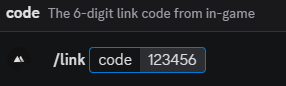
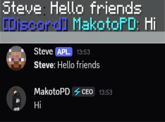

# Authentication & Discord

- [Authentication system](#authentication-system)
- [Discord bot (account linking)](#discord-bot-account-linking)
- [Discord chat relay (2-way)](#discord-chat-relay-2-way)

> **All Discord features require the KotlinForForge mod.** It provides the Kotlin runtime the
> Discord library depends on. Without it the server still starts, but Discord stays off.

---

## Authentication system

Forces players to register/login and/or link a Discord account before playing. Unauthenticated
players are **frozen** (can't move, interact, or chat).

### Modes (`settings.yml → auth.mode`)

| Mode | Password | Discord link | Use case |
|------|:-:|:-:|----------|
| `disabled` | – | – | Off (default) |
| `optional` | no | no | May register, not forced |
| `auth-only` | ✅ | – | Classic password login |
| `link-only` | – | ✅ | Discord link only |
| `full` | ✅ | ✅ | Password **and** Discord link |

```yaml
auth:
  mode: "full"
  session-timeout-hours: 24      # auto-login from the same IP within this window
  max-login-attempts: 5          # failed logins before a kick (counted per IP / 10 min)
  login-timeout-seconds: 60      # kick if not authenticated in time
  newbie-protection-minutes: 30  # invulnerability for brand-new players (0 = off)
```

### Player flow
- `/register <password> <password>` then `/login <password>`
- `/changepassword <old> <new> <new>` (invalidates old sessions)
- In `full` / `link-only`, link Discord first (below).

### Admin
| Command | Effect |
|---------|--------|
| `/auth reset <player>` | Wipe the account (password + link) |
| `/auth unlink <player>` | Force-unlink Discord |
| `/auth info <player>` | Show UUID, Discord, registration/login info |

Passwords are hashed with **bcrypt** in `accounts.db` — never plaintext.

---

## Discord bot (account linking)

The embedded **JDA** bot links Minecraft accounts to Discord via a slash command and can assign a
"linked" role.

### 1. Create the app & bot
1. [Discord Developer Portal](https://discord.com/developers/applications) → **New Application**.
2. **Bot** tab → **Reset Token** → copy it.
3. **Bot** tab → **Privileged Gateway Intents** → enable **Server Members Intent** (required for
   the linked role). Also enable **Message Content Intent** if you'll use the [chat relay](#discord-chat-relay-2-way).
4. **OAuth2 → URL Generator** → tick `bot` + `applications.commands`, grant at least **Manage
   Roles**, open the URL to invite the bot.
5. Put the bot's role **above** the role it assigns.

### 2. Configure (`integration.yml`)
```yaml
discord:
  enabled: true
  bot-token: "YOUR_BOT_TOKEN"
  guild-id: "YOUR_GUILD_ID"
  link-command-name: "link"     # slash command, e.g. /link
  linked-role-id: "ROLE_ID"     # "" to disable role assignment
  show-player-count: true       # live online count as bot status
```
Get IDs by enabling **Developer Mode** in Discord and right-clicking → **Copy ID**.

### 3. Test
1. Restart. Console prints `Discord bot connected successfully.`
2. In-game `/link` → you get a 6-digit code (valid 5 min).
3. On Discord, run the slash command with the code.
4. The bot links the account and assigns the role.

> 📸 **Screenshot:** the `/link` code in-game + the Discord slash command
> 

---

## Discord chat relay (2-way)

Bridges a Discord channel with in-game chat. Rides on the same bot — no extra setup beyond the
token.

### Requirements
- **KotlinForForge** installed.
- **Message Content Intent** enabled on the Bot tab (needed to read channel messages).

### Configure (`integration.yml → discord.relay`)
```yaml
discord:
  relay:
    enabled: true
    channel-id: "123456789012345678"     # right-click channel → Copy ID
    webhook-url: ""                        # optional; see below
    format-to-discord: "**<player>**: <message>"
    format-from-discord: "&9[Discord] &b<author>&7: &f<message>"
    announce-join-quit: true
    join-to-discord: "**<player>** joined the server"
    quit-to-discord: "**<player>** left the server"
```

### Behaviour
- **In-game → Discord:** global chat + optional join/leave. With a **webhook URL** set, messages
  post showing each player's **name and avatar**; without it, the bot posts plain text.
- **Discord → in-game:** messages in `channel-id` appear in chat using `format-from-discord`.
- **Local/range chat stays in-game** — only global chat is relayed.
- **Safety:** `@everyone`/role pings from the game are blocked; Discord colour codes are neutralised
  and long messages are trimmed.

To create a webhook: channel **Settings → Integrations → Webhooks → New Webhook → Copy URL**.

> 📸 **Screenshot:** a message crossing both ways (game ↔ Discord), webhook avatar visible
> 

---

## Website / backend sync (optional)

Mirror link/unlink events to an external backend, and let it unlink accounts in-game. See the
`integration.yml → web-sync` section — outbound `POST` on link/unlink, and an optional inbound
HTTP endpoint (`web-sync.api`). The mod's SQLite is always the source of truth; HTTP failures never
affect local state.

← Back to the [README](../README.md)
