# Chat & Cosmetics

Everything MKT Essentials adds to chat, player identity, and on-screen display.
All of it is **server-side** — players join with a vanilla client and see it work.

Every feature here is configured in `config/mktessentials/chat.yml` and ships **disabled or
with safe defaults**. Turn on what you want, run `/mkt reload`, done.

> 📸 **Screenshot:** overall chat showcase (formatted chat + tab + sidebar visible)
> 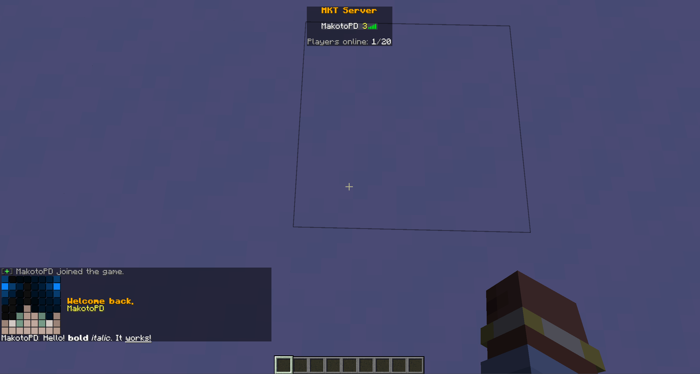

---

## Chat formatting

### Markdown

Write formatting inline, the way you'd type it in a messenger:

| You type | Result |
|----------|--------|
| `*italic*` | *italic* |
| `**bold**` | **bold** |
| `__underline__` | underlined |
| `~~strike~~` | ~~strike~~ |
| `??matrix??` | obfuscated / scrambled text |

Works in chat **and** on renamed items (anvil), written books, and signs.
Config: `chat.yml → markdown`.

> 📸 **Screenshot:** a chat line using several markdown styles at once
> 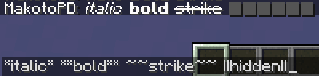

### Colours & tags

Legacy `&` colour codes and MiniMessage-style tags (`<gradient>`, `<hover>`, `<click>`, …) are
supported, filtered per player permission so only staff can use the fancier tags.

---

## Interactive chat

### Clickable links, emoji & spoilers

- **URLs** in a message become clickable links automatically.
- `:emoji:` shortcodes expand to symbols.
- `||spoiler||` renders as covered blocks that reveal the hidden text on hover.

Config: `chat.yml → replacement`.

> 📸 **Screenshot:** a message with a clickable link and a `||spoiler||` block
> 

### Inline objects

- `[item]` inserts the item you're currently holding — including its **full tooltip on hover**.
- `<head>` inserts your player head.

Config: `chat.yml → objects`.

> 📸 **Screenshot:** "check out my [item]" showing the item + hover tooltip
> 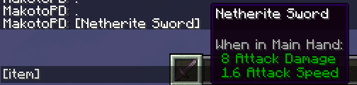

### Mentions

Type `@player` to highlight their name and ping them with a sound. Players can opt out with
`/mentions`. Config: `chat.yml → mention`.

> 📸 **Screenshot:** an `@player` mention highlighted in chat
> 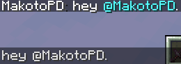

---

## Player identity

### Nicknames — `/nick`

Set a display nickname that appears **everywhere**: in chat, in the tab list, and **above the
player's head** — with the real skin preserved. Staff with `mktessentials.nick.see` see the real
name on chat hover. Config: `chat.yml → nickname`.

> 📸 **Screenshot:** the same player nicked in chat, tab, and above the head
> 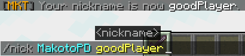

### Personal chat colour — `/chatcolor`

Each player can pick a personal base colour for their messages. Config: `chat.yml → chatcolor`.

### Chat settings GUI — `/chatsetting`

A clickable menu for personal chat options (mentions, etc.), plus an ignore-list menu.

> 📸 **Screenshot:** the `/chatsetting` GUI
> 

---

## Chat channels & extras

- **Local / per-world chat** — messages reach only nearby players (configurable radius) or the
  current world; a global prefix broadcasts server-wide. Config: `chat.yml → chat-local`.
- **Anonymous chat** — `/anon <message>` sends without your name attached. Config: `chat.yml → anon`.
- **Stream announcements** — `/stream` posts a clickable stream announcement. Config: `chat.yml → stream`.
- **Symbols** — `/symbol` inserts glyphs and special characters.
- **Question highlighting** — messages phrased as a question are emphasised. Config: `chat.yml → questionanswer`.
- **Roleplay** — `/me <action>` and `/do <narration>`.

> 📸 **Screenshot:** local chat radius demo (two players, one in range one out)
> 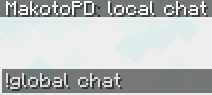

---

## Welcome greeting

A personalised join greeting (different for first-join vs returning players) that can render the
player's **actual skin face as pixel art** right in chat. Uses the player's name, so it works in
offline mode too. Config: `chat.yml → greeting`.

> 📸 **Screenshot:** a join greeting with the skin-face pixel art
> 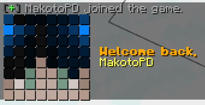

---

## On-screen display

### Tab list

A configurable header/footer with placeholders and frame animations, plus an optional
latency/ping display next to each player. Config: `chat.yml → tablist`.

> 📸 **Screenshot:** custom tab list header/footer + ping column
> 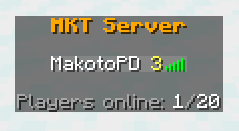

### Above-head nametags

Rank prefix/suffix rendered above players via scoreboard teams (nickname-aware).
Config: `chat.yml → nametag`.

### Below-name value

Show a number or health value beneath player nametags in the world.
Config: `chat.yml → belowname`.

> 📸 **Screenshot:** nametag with prefix + a below-name value
> 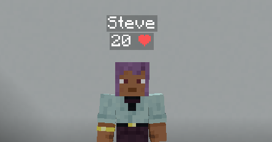

### Sidebar & boss bar

A configurable side scoreboard and a top boss bar, both supporting placeholders and animation.
Config: `chat.yml → sidebar`, `bossbar`.

> 📸 **Screenshot:** sidebar scoreboard
> 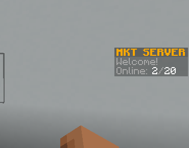

> 📸 **Screenshot:** boss bar
> 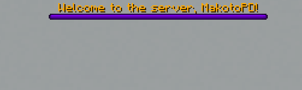

### Server brand (F3)

Customise the server name shown on the F3 debug screen, with optional rotation between several
texts. Config: `chat.yml → brand`.

> 📸 **Screenshot:** F3 screen showing the custom brand
> 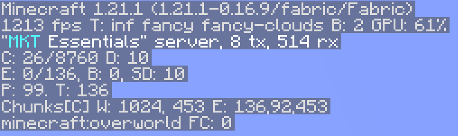

### MOTD & favicon

Set the server-list description and icon directly in the mod, with a separate maintenance MOTD.
Config: `chat.yml → motd`.

> 📸 **Screenshot:** server-list entry with custom MOTD + icon
> 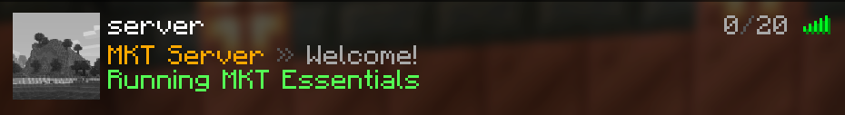

---

See also: [Coloured anvil / book / sign text](#) is part of `chat.yml → objects` — toggles
`anvil-color`, `book-color`, `sign-color`.

← Back to the [README](../README.md)
