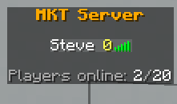

# Moderation

Full moderation toolkit — all punishments are recorded in `punishments.json` and viewable with
`/history <player>`.

## Commands

| Area | Commands |
|------|----------|
| Kick | `/kick <player> [reason]` |
| Ban | `/ban`, `/tempban <player> <duration> [reason]`, `/unban` |
| IP ban | `/banip <player\|ip> [reason]`, `/unbanip <ip>` (offline via last known IP) |
| Mute | `/mute`, `/tempmute <player> <duration> [reason]`, `/unmute` (offline supported) |
| Warn | `/warn`, `/unwarn`, `/warns` — auto-tempban at a configurable limit |
| History | `/history <player>` — warns, bans, mutes, kicks |
| Shadowban | `/shadowban`, `/unshadowban`, `/shadowbanlist` |

Durations parse like `1d12h`, `30m`, `2w`. Banned players see the reason and remaining time on
connect.

### Warn escalation (`settings.yml`)
```yaml
moderation:
  max-warns: 3              # active warns that trigger an auto-tempban (0 = off)
  warn-ban-duration: "1d"
```

---

## Shadowban

A shadowban punishes a player without telling them. Pick how it behaves with
`settings.yml → moderation.shadowban-method`:

| Method | What the player experiences |
|--------|------------------------------|
| `timeout` | Join fails with a fake "connection timed out" |
| `full` | Join fails with a generic disconnect |
| `internal-error` | Joins, then is kicked after ~2–3 s with a fake internal error |
| `phantom` | **Full isolation** (below) |

### Phantom = full isolation

The player joins into an **empty world**:

- They see **no other players** — neither entities in the world nor tab-list entries.
- **No one sees them** — hidden from everyone's world and tab.
- Their chat is **echoed only back to themselves** (they think it sent); they receive **no one
  else's** chat.
- No join/leave messages are generated for them.
- With a voice-chat mod hooked ([Plasmo Voice / Simple Voice Chat](integrations.md)), their
  **microphone is silently dropped**.
- Mobs and items stay visible, so the world doesn't look broken.

`/unshadowban <player>` restores everything instantly.

> 📸 **Screenshot:** a phantom player's empty tab list vs. a normal player's
> 

← Back to the [README](../README.md)
